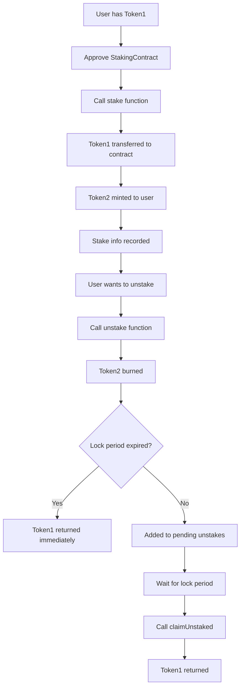

# Staking Contract Assignment

## Overview
This project implements a staking mechanism using two ERC20 tokens (Token1 and Token2) with a time-locked staking contract. Users can stake Token1 and receive Token2 at a 1:1 ratio, with a 7-day lock period before they can withdraw their original tokens.

## 🏗️ Architecture & Design Philosophy

### Thought Process & Design Decisions

#### 1. **Dual Token System Design**
I chose to create two separate ERC20 contracts (`Token1` and `Token2`) rather than using a single token with staking functionality. This approach provides:

- **Clear Separation of Concerns**: Token1 represents the original asset, while Token2 represents the staking receipt
- **Flexibility**: Each token can have different properties and use cases
- **Interoperability**: Both tokens can be traded independently on DEXs
- **Transparency**: Users can easily track their staking position through Token2 balance

#### 2. **Interface-Based Staking Contract**
The staking contract uses interface-based design to interact with both tokens:

```solidity
contract StakingContract {
    Token1 public token1;
    Token2 public token2;
    // ... staking logic
}
```

**Benefits of this approach:**
- **Modularity**: Token contracts can be upgraded independently
- **Reusability**: The staking contract can work with any ERC20 tokens
- **Maintainability**: Clear separation between token logic and staking logic
- **Testability**: Each component can be tested in isolation

#### 3. **Time-Locked Staking Mechanism**
Implemented a 7-day lock period with two-phase unstaking:
- **Phase 1**: User burns Token2 and requests unstake (goes to pending)
- **Phase 2**: After lock period, user can claim their original Token1

This design prevents immediate withdrawal and encourages long-term staking while providing flexibility.

## 📋 Contract Details

### Token1 (Original Asset)
- **Name**: "Token 1"
- **Symbol**: "TK1"
- **Decimals**: 18
- **Initial Supply**: 1,000,000 tokens
- **Purpose**: The original asset that users stake

### Token2 (Staking Receipt)
- **Name**: "Token 2"
- **Symbol**: "TK2"
- **Decimals**: 18
- **Initial Supply**: 0 tokens
- **Purpose**: Represents staking position, minted 1:1 when staking

### StakingContract
- **Lock Period**: 7 days
- **Staking Ratio**: 1:1 (1 Token1 = 1 Token2)
- **Features**: 
  - Stake Token1, receive Token2
  - Unstake with time lock
  - Pending unstake management
  - Multiple user support

## 🚀 Deployment Information

### Network: Lisk Sepolia Testnet
- **Chain ID**: 4202
- **RPC URL**: https://rpc.sepolia-api.lisk.com
- **Block Explorer**: https://sepolia-blockscout.lisk.com

### Contract Addresses

| Contract | Address |
|----------|---------|
| **Token1** | `0x6B645c9fa79150fF39209B05731991115d1b3661` |
| **Token2** | `0x347012F6B90CA2A925111eDfA06Db745507a425A` |
| **StakingContract** | `0x2CF8CBDA7568dE6045d091D1461dA9401c537fd2` |

### Verification URLs

| Contract | Verification Link |
|----------|-------------------|
| **Token1** | [View on Block Explorer](https://sepolia-blockscout.lisk.com/address/0x6B645c9fa79150fF39209B05731991115d1b3661) |
| **Token2** | [View on Block Explorer](https://sepolia-blockscout.lisk.com/address/0x347012F6B90CA2A925111eDfA06Db745507a425A) |
| **StakingContract** | [View on Block Explorer](https://sepolia-blockscout.lisk.com/address/0x2CF8CBDA7568dE6045d091D1461dA9401c537fd2) |

## 🔧 Technical Implementation

### Key Features

1. **ERC20 Compliance**: Both tokens follow the ERC20 standard
2. **Safe Math**: Uses Solidity 0.8.19 built-in overflow protection
3. **Events**: Comprehensive event logging for all operations
4. **Access Control**: Mint/burn functions for staking contract integration
5. **Time Management**: EVM timestamp-based lock period

### Staking Flow



## 🧪 Testing

The project includes comprehensive tests covering:
- ✅ Contract deployment
- ✅ Staking functionality
- ✅ Unstaking with time lock
- ✅ Multiple user scenarios
- ✅ Edge cases and error conditions

**Test Results**: 16/16 tests passing

## 🛠️ Development Setup

### Prerequisites
- Node.js (v16+)
- npm or yarn
- Hardhat

### Installation
```bash
npm install
```

### Compilation
```bash
npx hardhat compile
```

### Testing
```bash
npx hardhat test
```

### Deployment
```bash
# Set private key
npx hardhat vars set PRIVATE_KEY

# Deploy to Lisk Sepolia
npx hardhat run scripts/deploy.ts --network lisk-sepolia
```

### Verification
```bash
npx hardhat run scripts/verify.ts --network lisk-sepolia
```

## 📁 Project Structure

```
├── contracts/
│   ├── Token1.Sol          # Original asset token
│   ├── Token2.sol          # Staking receipt token
│   └── StakingContract.sol # Main staking contract
├── scripts/
│   ├── deploy.ts           # Deployment script
│   ├── verify.ts           # Verification script
│   └── testStaking.ts      # Local testing script
├── test/
│   └── Staking.ts          # Comprehensive test suite
└── hardhat.config.ts       # Hardhat configuration
```

## 🔒 Security Considerations

1. **Reentrancy Protection**: No external calls after state changes
2. **Access Control**: Mint/burn functions restricted to staking contract
3. **Input Validation**: All user inputs validated
4. **Safe Transfers**: Proper error handling for token transfers
5. **Time Lock**: Prevents immediate withdrawal attacks

## 🎯 Future Enhancements

1. **Staking Rewards**: Add reward distribution mechanism
2. **Variable Lock Periods**: Allow users to choose lock duration
3. **Governance**: Add DAO governance for parameter changes
4. **Liquidity Pools**: Integration with DEX for Token2 trading
5. **Analytics**: Add staking statistics and analytics

## 👨‍💻 Author

**Akinbobola Akiode**
- **Owner Address**: `0x838Abf92E994e088e641399e91AcE43514038b90`
- **Project**: Web3Bridge Cohort XIII - Week 5, Day 1 Assignment

---

*This project demonstrates advanced Solidity development concepts including contract interfaces, time-locked mechanisms, and comprehensive testing strategies.*
