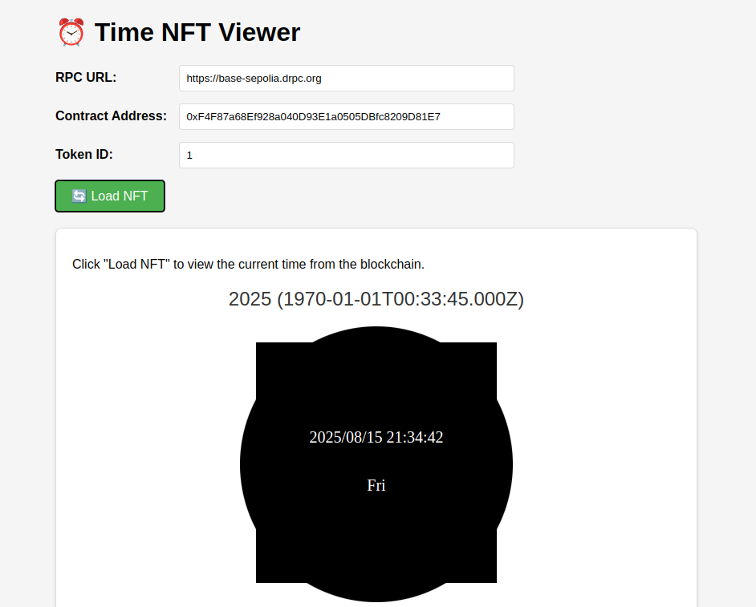

# TimeSVGNFT

An on-chain dynamic NFT that displays the current blockchain time in a beautifully rendered SVG clock. The NFT updates its appearance based on the current block timestamp, showing hours, minutes, and seconds with smooth animations.

<div align="center">
  
</div>

## Features

- **Fully On-Chain**: All metadata and SVG are generated and stored on-chain
- **Dynamic Clock**: Displays current time with hour, minute, and second hands
- **Date Display**: Shows current date in YYYY/MM/DD format
- **Responsive Design**: SVG renders beautifully at any size
- **Gas Efficient**: Optimized for minimal gas consumption

## Contract Address

- **Base Sepolia Testnet**: [0xF4F87a68Ef928a040D93E1a0505DBfc8209D81E7](https://sepolia.basescan.org/address/0xF4F87a68Ef928a040D93E1a0505DBfc8209D81E7)

## Prerequisites

- [Foundry](https://getfoundry.sh/) (Forge, Anvil, Cast)
- [Node.js](https://nodejs.org/) (for frontend)
- [Git](https://git-scm.com/)

## Installation

1. Clone the repository:
   ```bash
   git clone https://github.com/jvcByte/TimeSVGNFT.git
   cd TimeSVGNFT
   ```

2. Install dependencies:
   ```bash
   forge install
   ```

## Testing

Run the test suite:

```bash
forge test -vvv
```

## Deploying

### Local Development

1. Start a local Anvil node:
   ```bash
   anvil
   ```

2. In a new terminal, deploy to the local network:
   ```bash
   forge script script/TimeSVGNFT.s.sol --rpc-url http://localhost:8545 --broadcast
   ```

### Base Sepolia Testnet

1. Set up your environment variables in a `.env` file:
   ```
   PRIVATE_KEY=your_private_key
   ETHERSCAN_API_KEY=your_etherscan_api_key
   BASE_SEPOLIA_RPC_URL=your_base_sepolia_rpc_url
   ```

2. Deploy to Base Sepolia:
   ```bash
   forge script script/TimeSVGNFT.s.sol --rpc-url $BASE_SEPOLIA_RPC_URL --broadcast --verify -vvvv
   ```

## Minting an NFT

After deployment, you can mint an NFT using the following Cast command:

```bash
cast send <CONTRACT_ADDRESS> "mint(address)" <RECIPIENT_ADDRESS> --private-key $PRIVATE_KEY --rpc-url $BASE_SEPOLIA_RPC_URL
```

## Viewing the NFT

1. Open `view_nft_simple.html` in a web browser
2. Enter the contract address and token ID
3. Click "Load NFT" to view the dynamic clock

## Project Structure

- `src/`: Solidity smart contracts
  - `TimeSVGNFT.sol`: Main NFT contract with SVG generation
- `test/`: Foundry test files
- `script/`: Deployment scripts
- `view_nft_simple.html`: Simple web interface to view the NFT

## License

MIT

## Acknowledgments

- Built with [Foundry](https://getfoundry.sh/)
- Deployed on [Base Sepolia](https://docs.base.org/)
- Inspired by on-chain generative art projects
