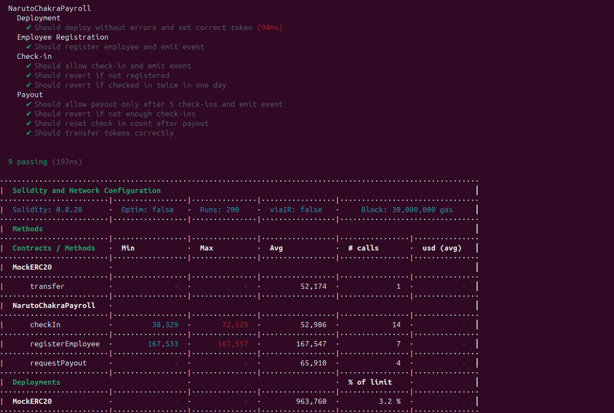
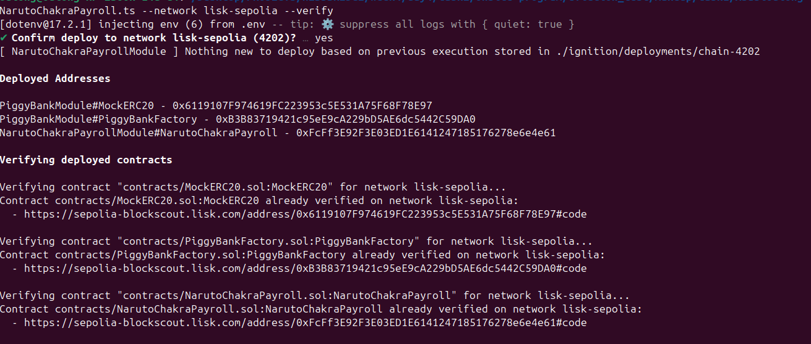

# Sample Hardhat Project

This project demonstrates a basic Hardhat use case. It comes with a sample contract, a test for that contract, and a Hardhat Ignition module that deploys that contract.

Try running some of the following tasks:

```shell
npx hardhat help
npx hardhat test
REPORT_GAS=true npx hardhat test
npx hardhat node
npx hardhat ignition deploy ./ignition/modules/Lock.ts
```




Verifying contract "contracts/NarutoChakraPayroll.sol:NarutoChakraPayroll" for network lisk-sepolia...
Contract contracts/NarutoChakraPayroll.sol:NarutoChakraPayroll already verified on network lisk-sepolia:
  - https://sepolia-blockscout.lisk.com/address/0xFcFf3E92F3E03ED1E6141247185176278e6e4e61#code

